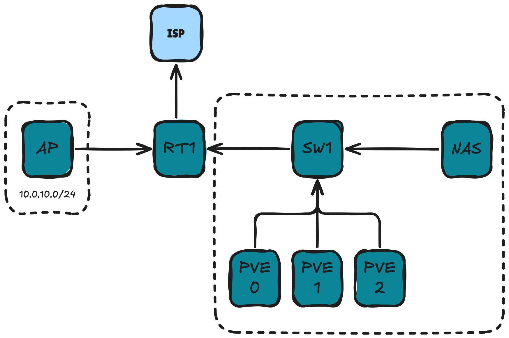
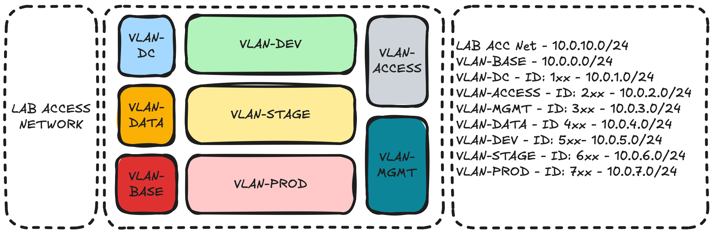
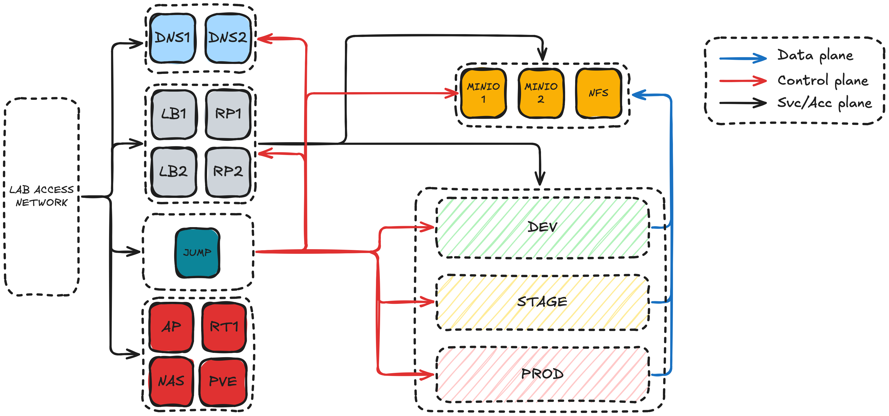

# HomeLab

Everything as code for HomeLab based on Proxmox.

 

## Architecture diagrams
### Physical infrastructure
- ISP - 1Gbps connection
- RT1 - Ubiquiti EdgeRouter X
- SW1 - Ubiquiti UniFi Flex mini
- AP1 - TP Link AC1200
- PVE0 - Dell Optiplex 7040, Intel Core i7 6700T, 32GB DDR4, 500GB NVMe
- PVE1 - Dell Optiplex 5090, Intel Core i5 10500T, 32GB DDR4, 500GB NVMe
- PVE2 - Dell Optiplex 5090, Intel Core i5 10500T, 32GB DDR4, 500GB NVME
- NAS - QNAP TS-230

### Network segmentation

### System diagram

## Infrastructure
## 